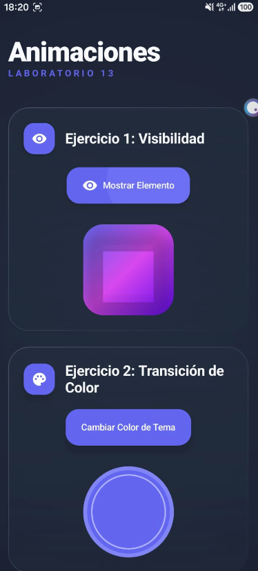
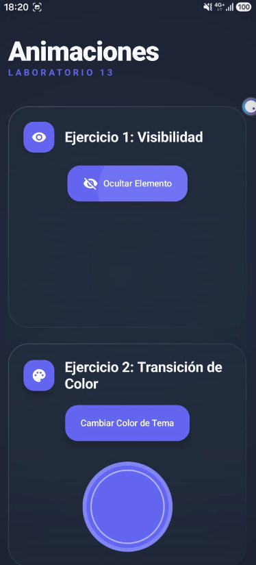
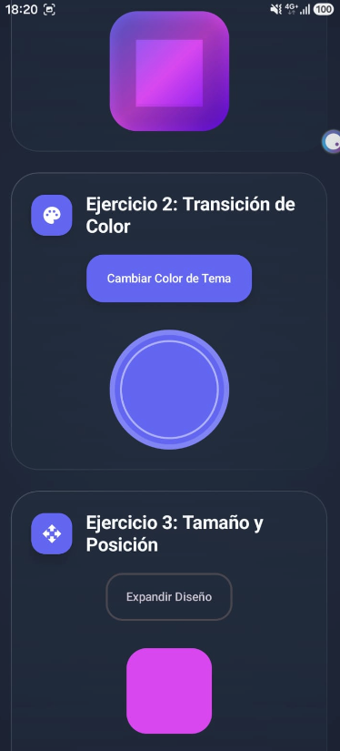
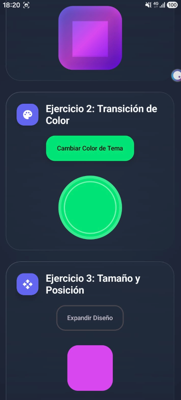
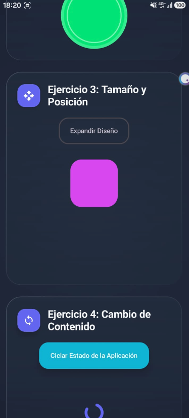
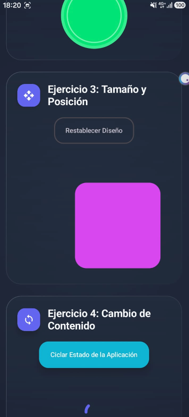
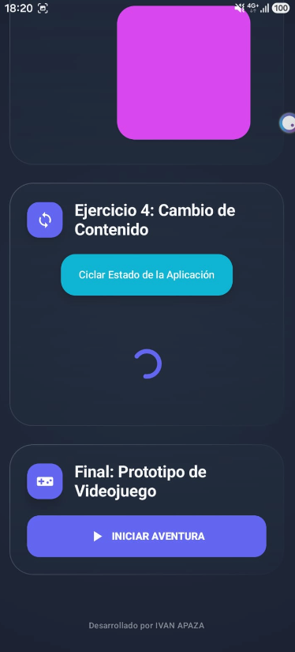
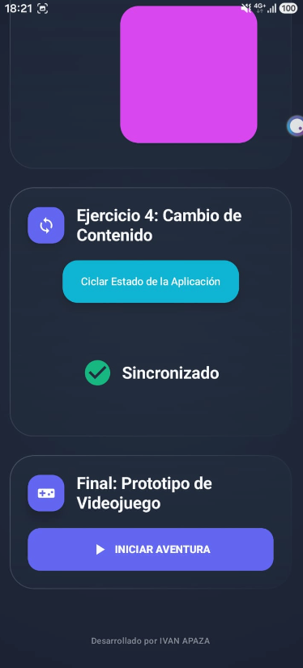
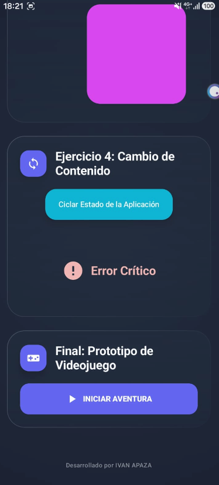
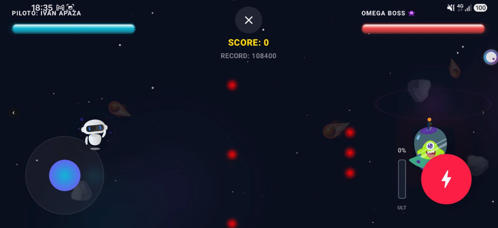

# 🚀 Jetpack Compose Animations - Laboratory 13

A modern Android application developed with **Jetpack Compose** showcasing advanced animation APIs to create smooth, interactive, and visually stunning user interfaces.

## 📱 Project Overview
This application is organized in a highly modular fashion, presenting 5 interactive sections ranging from basic transition concepts to a complete arcade video game.

## 🎥 Media & Demos

### 🎮 Gameplay Demonstration Videos
Here are two gameplay recordings demonstrating the final retro space combat action:

- **Demo Video 1:** [Gameplay Clip 1 (MP4)](readme_media/video_gameplay1.mp4)
- **Demo Video 2:** [Gameplay Clip 2 (MP4)](readme_media/video_gameplay2.mp4)

---

## ✨ Key Features

### 1. 👁️ Visibility Control
- Uses `AnimatedVisibility` for elegant component entries and exits.
- **Effects:** Combined `fadeIn` + `scaleIn` and `fadeOut` + `scaleOut` transitions.
- **UI Design:** Stretched cards with modern background gradients.

<div align="center">
  
  
</div>

### 2. 🎨 Color Transitions
- Implements `animateColorAsState` for smooth palette transitions.
- **Functionality:** Real-time fluid color morphing matching the primary material theme.
- **Interactive Controls:** Toggle buttons reflecting the current selected states.

<div align="center">
  
  
</div>

### 3. 📏 Size and Position Dynamics
- Utilizes `animateDpAsState` and `Modifier.offset`.
- **Physics Engine:** Custom `spring` configuration providing natural elastic bounces.
- **Control:** Simultaneous scaling and coordinate shifting of UI components.

<div align="center">
  
  
</div>

### 4. 🔄 Dynamic Content Swapping
- Implements `AnimatedContent` for clean UI state transitions.
- **State Machine:** Handles `Loading`, `Content` (success), and `Error` layouts.
- **Transitions:** Elegant vertical slide-and-fade animations.

<div align="center">
  
  
  
</div>

### 5. 🎮 Retro Arcade Video Game (Mini-Game: Cyber-Battle)
- **Dedicated Windows:** Launches in a lock-oriented landscape view (`GameActivity`).
- **Lag-Free Movement:** Joystick with screen-pixel density scaling (`LocalDensity`) updating at 60 FPS.
- **Character Animation (Lottie JSON Integration):**
  - Displays high-quality vector animations for both the player (`bueno.json`) and the boss (`malo.json`).
  - Animates the Lottie composition loop infinitely at 60 FPS.
- **Advanced Compose Animation Mashup:**
  - **Impact Pop Scale Effect:** Leverages a spring-based scale animation (`animateFloatAsState` with `dampingRatio = Spring.DampingRatioHighBouncy`) that triggers a visual "pop" bounce whenever a bullet hits a target, immediately returning it to normal size.
  - **Floating Damage/Text Particles:** Fades and scrolls custom indicators (`💥 -12% HP`, `⚡ IMPACT!`, `🛡️ DODGED`) upward frame by frame.
  - **Active Parallax Space Background:**
    - **Parallax Starfield:** 45 stars scrolling across 3 distinct speed layers.
    - **Nebula Clouds:** 3 slow-moving gaseous dust clouds with radial color gradients (Cyan, Indigo, and Fuchsia).
    - **Asteroid Belt:** Rotating space debris (`🪨` and `☄️`) with independent spin rates.
  - **Shooting Stars:** Draws diagonal velocity vectors on a canvas layer with linear gradient tails.
  - **HUD LED Health Bars:** Glowing indicators utilizing pulsing drop-shadows and vertical core-white LED gradients.
  - **Programmatic 8-bit Sound Synthesizer:** Real-time PCM wave generation via `AudioTrack`:
    - *Laser Shot*: Square wave sliding frequency pitch (`1000Hz` to `300Hz`).
    - *Explosions*: Attenuated white noise bursts.
    - *Damage Buzzer*: Low-frequency square wave.
    - *Victory Arpeggio*: Upbeat ascending major chord progression.
    - *Defeat Chime*: Descending somber minor melody.
    - *Power-Up Sound*: Rapid ascending arpeggio.
  - **Boss Rage Mode (Two-Stage Progression):**
    - **Phase 1 (Fury Mode):** Activates at $\le$ 70% Boss HP. Boss moves faster, direct bullet speeds increase to `-18f`, shoot cooldown reduces to `22` frames, BGM speed accelerates, and ram dash speed increases to `36f` (inflicting **35% damage** on hit). Boss invokes up to 3 drones.
    - **Phase 2 (Extreme Fury Mode):** Activates at $\le$ 35% Boss HP. Boss moves vertically at a high frequency, direct bullet speeds increase to `-24f`, shoot cooldown is reduced to a frantic `13` frames, and ram dash speed reaches a super sonic **`46f`** (inflicting **45% critical damage**). The diagonal attack sprays **6 lasers simultaneously** in a massive fan, and the boss invokes up to 4 high-health drones (`5 HP` each).
  - **Boss Drones (Minions):** The boss invokes floating escort drones (`🛸`) that fly vertically and shoot green simple lasers. Hitting drones charges the Ultimate Gauge.
  - **Boss Ram Dash Attack:** Every 7-8 seconds, the boss locks onto the player's y-coordinate, warning the player with a neon-yellow/red warning glow and alarm beeps, then dashes horizontally at extreme speed.
  - **Ultimate Cyber-Beam:** Hitting the boss or drones charges a vertical energy gauge. When it reaches 100% capacity, a fuchsia `⚡ULT⚡` button lights up. Activating it releases a massive horizontal plasma beam for 3 seconds that vaporizes all active enemy bullets and deals continuous damage to the boss and drones.
  - **Combos & Scores:** Scoring multiplier linked to uninterrupted hits, saved locally via `SharedPreferences`.
  - **Screen Shake:** Oscillates the main game frame on player hit.
- **Balanced Game Difficulty & Power-Ups:**
  - **High Durability Boss:** Player standard lasers deal **0.3% damage** (requiring up to 333 hits to defeat the boss), and the ultimate beam deals `0.1%` damage per tick.
  - **Scalable Player Damage:** Boss bullets deal scaling damage: `10%` normally, `14%` in Phase 1 Rage, and `18%` in Phase 2 Extreme Rage.
  - **Highly Frequent and Concurrent Power-ups:** Power-ups spawn extremely often (1 check every 25 frames) and up to **5 items** can float on screen concurrently.
  - **Equally Distributed Buffs:** All 6 positive power-ups have the same spawning probability (1/6):
    - ❤️ **Health Restore (`HEALTH_RESTORE`)**: Restores 25% HP.
    - 🛡️ **Shield (`SHIELD`)**: Blocks the next hit.
    - ⚡ **Double Shot (`DOUBLE_SHOT`)**: Fires two parallel lasers.
    - 🔱 **Triple Shot (`TRIPLE_SHOT`)**: Fires a three-laser fan.
    - ⏳ **Time Slow (`TIME_SLOW`)**: Slows enemy bullets and boss/drone movements by 50% for 5 seconds.
    - 🔥 **Rapid Fire (`RAPID_FIRE`)**: Reduces player laser cooldown to 3 frames for 6 seconds.

<div align="center">
  
</div>

---

## 🛠️ Architecture & Technologies
- **Language:** Kotlin 2.2.10
- **UI Toolkit:** Jetpack Compose with Material Design 3
- **Animations:** Lottie Compose 6.4.0
- **Icons:** Material Icons Extended
- **Build Tool:** Gradle (Kotlin DSL) with Version Catalogs

---

## 📂 Project Structure
```text
com.example.glab_s13_bpareja_2025
├── components
│   ├── color        # Exercise 2: Color transitions
│   ├── comun        # Shared common UI cards & Joystick
│   ├── contenido    # Exercise 4: Content states
│   ├── dimensiones  # Exercise 3: Size & position animations
│   ├── videojuego   # Final Arcade Game
│   │   ├── BgmManager.kt        # 2-Voice BGM loop tracker
│   │   ├── GameBackground.kt    # Space Parallax Background
│   │   ├── GameModels.kt        # Data structures & parameters
│   │   ├── GameScreen.kt        # Main orchestrator & state loop
│   │   ├── HealthBar.kt         # Custom neon LED health bar
│   │   ├── HighScoreManager.kt  # Persistent SharedPreferences records
│   │   ├── LottieCharacter.kt   # Lottie JSON player & boss renders
│   │   ├── ParticleSystem.kt    # Sparks & explosion emitters
│   │   └── SoundManager.kt      # Real-time PCM synthesizer
│   └── visibilidad  # Exercise 1: Visibility entry/exit
└── MainActivity     # Main application launcher
```

---

## 👤 Credits
**IVAN APAZA**  
*Laboratorio 13 - Mobile Application Development*
